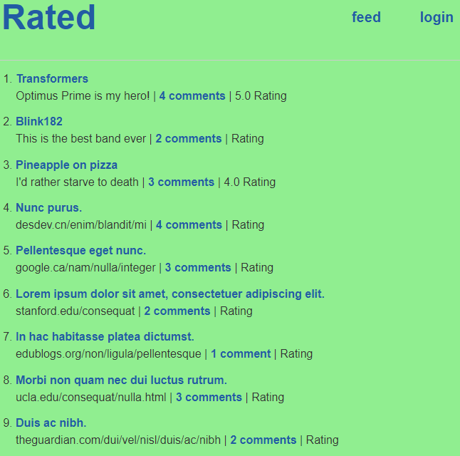

# Rated

Rated is a site where users can interact with each other about content

Any user can view the content posted on the page but will have the option to sign up or log in to comment, upvote, downvote, or rate a post

The user can, if loggin in, can make a post about a topic, movie, song, or whatever crosses their mind and other users can rate their post and interact in the comments

Comments can be upvoted or downvoted 

Rating is taken from each user that rates the post and the rating displayed is the average of each, highest being 10 and lowest being 1

